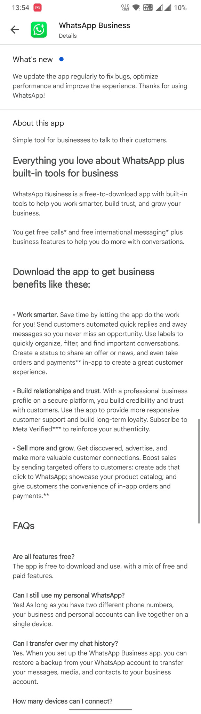
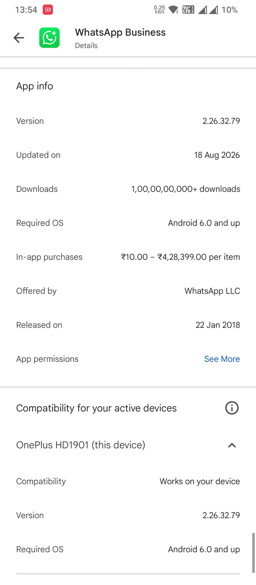
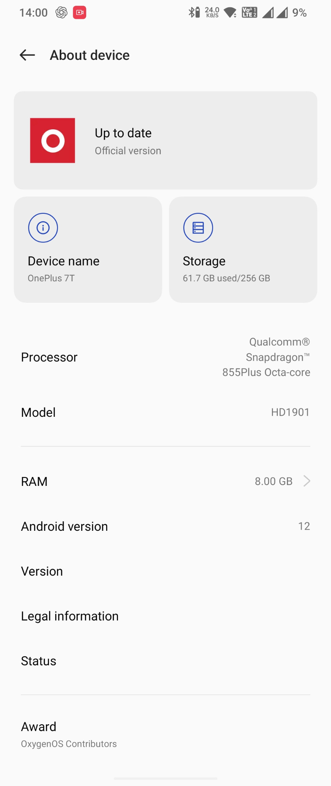
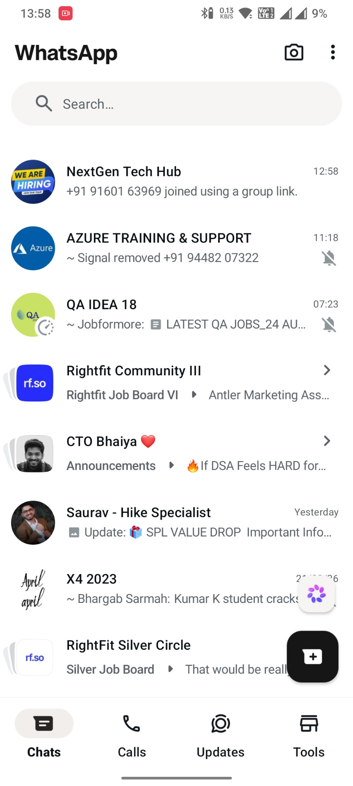
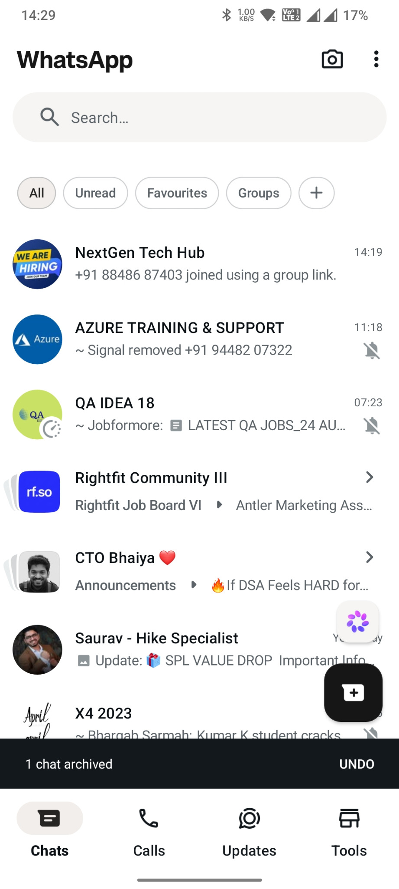
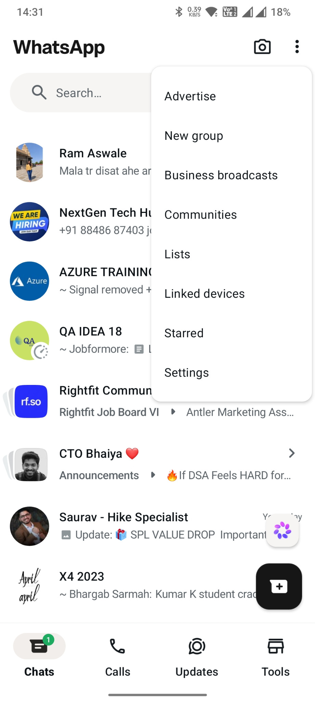
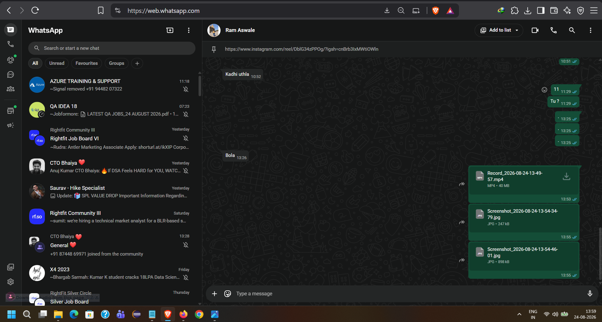
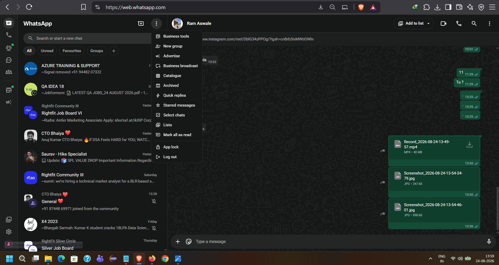
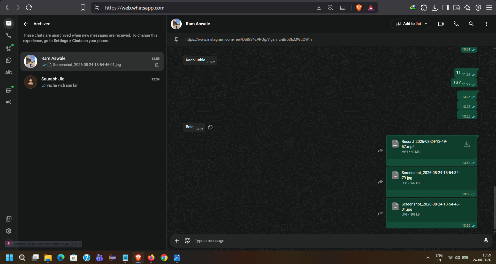

# WhatsApp Business Android - Archived Chats Section Not Visible

> This is an independent bug reproduction report and is not affiliated with or endorsed by WhatsApp or Meta.

## Summary

WhatsApp Business for Android allows chats to be archived successfully, but the Android application does not expose a visible **Archived** section afterward.

As a result, archived chats cannot be accessed or unarchived from the Android application.

The same archived chats remain available through WhatsApp Web using the same account, where the **Archived** section is visible and accessible.

## Environment

* Application: WhatsApp Business for Android
* App Version: 2.26.32.79
* Device: OnePlus 7T
* Model: HD1901
* Android Version: 12

## Steps to Reproduce

1. Open WhatsApp Business on Android.
2. Long-press any chat.
3. Select **Archive**.
4. Confirm that the application displays the archive confirmation.
5. Return to the main **Chats** screen.
6. Look for an **Archived** section.
7. Open the three-dot menu and check for an **Archived** option.
8. Observe that no Archived section or menu option is available.
9. Open WhatsApp Web using the same account.
10. Open **Menu → Archived**.
11. Observe that the archived chat is available and accessible there.

## Expected Behavior

After archiving a chat, WhatsApp Business for Android should provide an **Archived** section that allows users to:

* View archived chats
* Open archived conversations
* Unarchive chats when required

## Actual Behavior

The Android application successfully archives the selected chat and displays an archive confirmation.

However:

* No **Archived** section is visible on the main Chats screen.
* No **Archived** option is available in the three-dot menu.
* The archived chat cannot be accessed from the Android application.

The same archived chat remains accessible through WhatsApp Web.

## Cross-Platform Comparison

| Platform                  | Archive Chat | Archived Section Available | Access Archived Chats |
| ------------------------- | ------------ | -------------------------- | --------------------- |
| WhatsApp Business Android | Yes          | No                         | No                    |
| WhatsApp Web              | Yes          | Yes                        | Yes                   |

## Evidence

### Android

#### WhatsApp Business App

#### WhatsApp Business Version

#### Device Environment

#### Archived Section Not Visible

The Android main Chats screen does not display an **Archived** section.

#### Chat Archived Successfully

The application confirms that a chat has been archived.

#### Archived Option Not Available in Menu

The Android three-dot menu does not contain an **Archived** option.

### WhatsApp Web

#### WhatsApp Web Main Screen

#### Archived Option Available

WhatsApp Web provides an **Archived** option in its main menu.

#### Archived Chats Accessible

The archived chat is available inside the **Archived** section on WhatsApp Web.

## Video Reproduction

### Primary Android Reproduction

The following recording demonstrates the issue on WhatsApp Business for Android:

[▶ Watch primary Android screen recording](evidence/10-android-archive-bug-reproduction.mp4)

### Additional Android Reproduction

The following recording provides an additional reproduction of the same issue:

[▶ Watch additional Android screen recording](evidence/11-android-additional-archive-bug-reproduction.mp4)

## Reproducibility

The issue is consistently reproducible on:

* WhatsApp Business 2.26.32.79
* OnePlus 7T
* Model HD1901
* Android 12

The archived chat remains synchronized with the account because it is still visible through WhatsApp Web.

## Notes

This repository contains only reproduction steps and supporting evidence for the observed behavior.

The WhatsApp Business Android application source code is not part of this repository.
